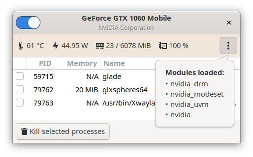
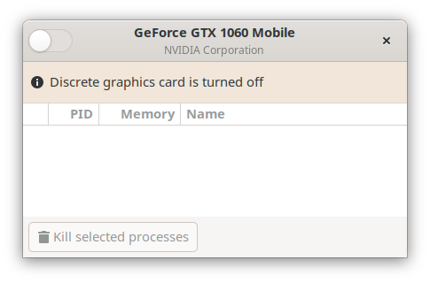
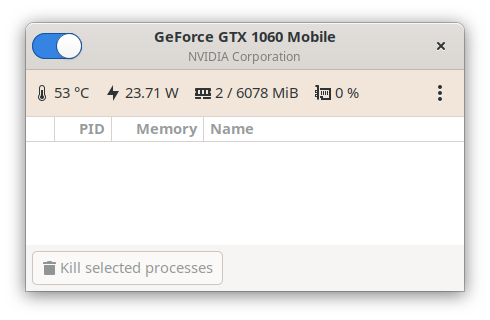
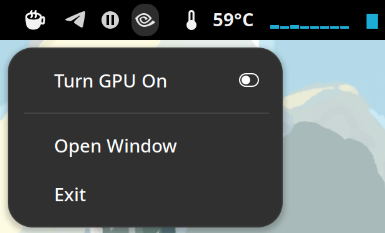
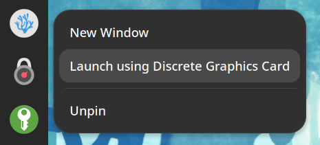
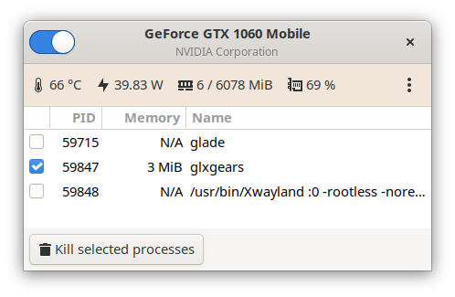

# bbswitch-gui

GUI for monitoring and toggling NVIDIA GPU power on Optimus laptops.

Provides a user-friendly interface for managing power state
and monitoring utilization of dedicated graphics adapter.



Useful for pre-Turing GPU generations without dynamic power management features,
allows to fully benefit from NVIDIA
[PRIME Render Offload](https://download.nvidia.com/XFree86/Linux-x86_64/495.46/README/primerenderoffload.html)
technology without need to keep graphics adapter turned on all the time.

For Turing generation cards with Intel Coffee Lake or above CPUs as well as some
Ryzen CPUs like the 5800H, it is possible to fully power down the GPU when not in use
automatically without user interaction:
[see NVIDIA documentation](https://us.download.nvidia.com/XFree86/Linux-x86_64/495.46/README/dynamicpowermanagement.html).

Uses [bbswitchd](https://github.com/polter-rnd/bbswitchd) daemon
to switch video adapter power state (`ON` or `OFF`) and NVML to monitor GPU parameters.

## Installation

### Using prebuilt packages

The most straightforward way to install is to use prebuilt packages from
[copr for Fedora](https://copr.fedorainfracloud.org/coprs/polter/bumblebee)
or [PPA for Ubuntu](https://launchpad.net/~polter-rnd/+archive/ubuntu/bbswitch-gui).

For Fedora:

```bash
$ sudo dnf copr enable polter/bumblebee
$ sudo dnf install bbswitch-gui
```

For Ubuntu:
```bash
$ sudo add-apt-repository ppa:polter-rnd/bbswitch-gui
$ sudo apt update
$ sudo apt install bbswitch-gui
```

After package installation please check that your user have been added to `bbswitchd`
group using `groups` command, and then re-login or reboot the machine to apply it.

That simple.

### Building from source

#### Requirements

Check if you have `PyGObject` module installed (usually available in you Linux ditribution),
`pynvml` module for gathering GPU information, `fuser` utility to find processes using video card
and `GTK+` library for GUI (development package is not needed).

For Fedora:

```bash
$ sudo dnf install gtk3 python3-gobject python3-py3nvml hwdata psmisc
```

For Ubuntu:

```bash
$ sudo apt-get install libgtk-3-0 python3-gi python3-pynvml hwdata psmisc
```

To be able to manage dedicated GPU power state, you also need to install `bbswitchd` daemon.
Refer to [Installation](https://github.com/polter-rnd/bbswitchd#installation) paragraph
of [bbswitchd](https://github.com/polter-rnd/bbswitchd) manual.

#### Installing using pip

You can build and install a `wheel` or `egg` package using `pip`.

Example of per-user installation:

```bash
$ python3 -m pip install --user .
```

And system-wide:

```bash
$ sudo python3 -m pip install .
```

After that `bbswitch-gui` command will appear in your `PATH`.
Desktop files are not created when installing by `pip`.


#### Installing using meson

First you need to install `meson` build system:

For Fedora:

```bash
$ sudo dnf install meson
```

For Ubuntu:

```bash
$ sudo apt-get install python3-distutils meson
```

Then build and install the project (specify `--prefix` argument
if you need to unstall somewhere not in `/usr/local`):

```bash
$ meson build # --prefix=/usr
```

To install the package on your system:

```bash
$ sudo meson install -C build
```

After that `bbswitch-gui` command will appear in your `PATH`
and `bbswitch-gui.desktop` will appear in menu.

## Usage

Run `bbswitch-gui` command or select `BBswitch GUI` app from menu, the window will appear:



You can turn dedicated graphics card on and off using switch control in the top left corner,
after that GPU monitoring panel will appear:



Also a nice tray icon will appear allowing you to switch the power state even without
launching the window:



If you have [switchroo-control](https://gitlab.freedesktop.org/hadess/switcheroo-control)
installed, after GPU has been enabled you should be able to launch any application
on dedicated graphics card by right-click in GNOME shell:



To launch from console you need to setup environment variables, e.g.:

```bash
$ __NV_PRIME_RENDER_OFFLOAD=1 __GLX_VENDOR_LIBRARY_NAME=nvidia glxgears
```

To use PRIME offload for Vulkan applications:

```
$ __NV_PRIME_RENDER_OFFLOAD=1 __VK_LAYER_NV_optimus=NVIDIA_only vkmark
```

Then you will see a list of applications using the dedicated GPU:



You won't be able to turn GPU off while some application still uses it.
To force killing them you can check desired processes and click **Kill selected processes**
button.

## Tips & Tricks

To make `bbswitch-gui` auto-start minimized to tray, one can create a file
`~/.config/autostart/io.github.polter-rnd.bbswitch-gui.desktop` with the following
content (`-m` option means run minimized):

```ini
[Desktop Entry]
Type=Application
Encoding=UTF-8
Name=BBswitch GUI
Comment=GUI tool for managing NVIDIA GPU power states and utilization
Exec=/usr/bin/bbswitch-gui -v -m
Icon=bbswitch-gui
Categories=System;Monitor;Utility;X-GNOME-Utilities;
Keywords=nvidia;bbswitch;optimus;prime;
X-AppInstall-Keywords=nvidia;bbswitch;optimus;prime;
X-GNOME-Keywords=nvidia;bbswitch;optimus;prime;
X-GNOME-UsesNotifications=true
```

## Known issues and workarounds

After logout from GNOME shell with enabled NVIDIA GPU, on next login it will
detect it and take in use, thus making it impossible to turn dedicated GPU off.

Workaround is to hide NVIDIA GPU from `gnome-shell` process while keeping it available
for all other processes. It can be solved by creating a fake directory on startup for
EGL library configurations which is normally in `/usr/share/glvnd/egl_vendor.d`:

```bash
$ ls /usr/share/glvnd/egl_vendor.d/
10_nvidia.json  50_mesa.json
```

Then override configuration of `org.gnome.Shell@wayland.service` user-owned systemd unit:

```bash
$ systemctl --user edit org.gnome.Shell@wayland.service

[Service]
ExecStartPre=/usr/bin/mkdir -p /tmp/egl_vendor.d
ExecStartPre=/usr/bin/rm -f /tmp/egl_vendor.d/10_nvidia.json
ExecStartPre=/usr/bin/ln -fs /usr/share/glvnd/egl_vendor.d/50_mesa.json /tmp/egl_vendor.d
Environment=__EGL_VENDOR_LIBRARY_DIRS=/tmp/egl_vendor.d
ExecStartPost=/usr/bin/ln -fs /usr/share/glvnd/egl_vendor.d/10_nvidia.json /tmp/egl_vendor.d
```

On each `gnome-shell` startup it will see only `50_mesa.json` configuration
and only then `10_nvidia.json` will appear therefore making it availabe for all other processes.

## Contributing

Pull requests are welcome. For major changes, please open an issue first
to discuss what you would like to change.

Please make sure to update tests as appropriate.

## License

This software is distributed under [GNU GPL v3](https://www.gnu.org/licenses/gpl-3.0.en.html).
See [LICENSE](https://raw.githubusercontent.com/polter-rnd/bbswitchd/master/LICENSE)
file for more information.
